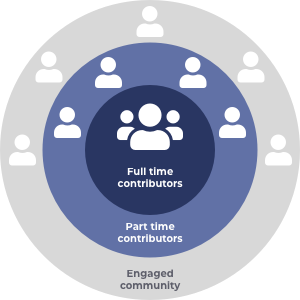

# Overview

The Contributors League is a team of community members within the Cardano ecosystem who have been funded directly from the treasury to help manage, support and improve the ecosystem. Contributors help in a multitude of areas including working on infrastructure and tooling, supporting the community, improving processes or supporting other projects in the ecosystem.

A key objective for the Contributors League is to help create the best environment possible for full time contributors. A good environment will mean maximising the alignment and collaboration between these contributors so they are able to most effectively maximise their impact when working on improving the ecosystem.&#x20;



### **Initial focus**

An initial focus for the Contributors League will be supporting Project Catalyst. The reasons for this are:

* IOG have been trying to offload the responsibility of Project Catalyst onto the community faster than other parts of the core ecosystem.
* Project Catalyst has a large amount of areas that can be worked on by contributors which represents a big opportunity for providing high impact to the community.&#x20;

### Contents

* [**Contributor**](broken-reference) - Find out about what would be expected from a Catalyst contributor.
* ****[**Contributor Guides**](broken-reference) - Guides on how to create a proposal as a contributor candidate and also how to assess candidate proposals.
* ****[**Treasury**](broken-reference) - Details of how full time contributors would manage a Catalyst focussed treasury that would be used for rapid funding that supports the ecosystem.
* [**Analysis**](broken-reference) - Break down of the contributor structure, analysis on differences between contributors and employees and thoughts towards future improvements.
* [**Background**](broken-reference) - A background into the ecosystem and funding approaches, working structures and governance processes that led to the need to fund contributors as a step forward for the ecosystem.&#x20;
* [**Proposals**](broken-reference) - List of all challenge setting proposals created for hiring contributors in the ecosystem.&#x20;
