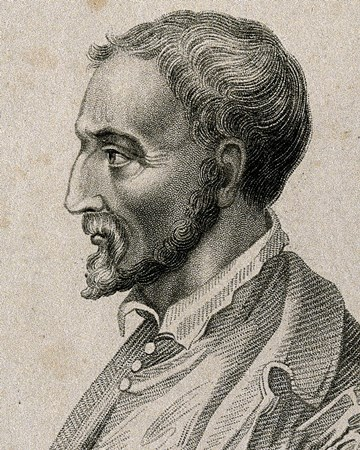

# Example Proposal - Gerolamo Cardano

### Role

**Primary role**

Product

**Preferred role responsibilities**

Product

* Create and maintain product development workflows that take ideas and problem sensing through to implementation of solutions, outcome tracking and continued iterative improvement
* Create and iterate user experience flows and implementation plans based on user feedback, usage data and product planning
* Write and maintain documentation about ecosystem priorities and roadmaps, product processes, feature releases and product workflows.
* Provide support about ecosystem products, requirements, priorities and existing user problems to help others understand the current ecosystem
* Coordinate efforts around product development to encourage collaboration and bring more alignment around problems, prioritisation, suggested solutions, improvements to existing solutions and shared understanding of performance outcomes for recent product releases
* Host discussions and meetings to gather product feedback from the community or showcase existing progress and current product development priorities

Design

* Create and iterate on design concepts, wireframe designs, user flows and layouts for ecosystem applications
* Gather community feedback regarding any design and interfaces used to understand the ease of use and user sentiment to help find any areas for improvement

Analysis

* Conduct ecosystem research and analysis to identify problems and opportunities for improvement
* Collect, aggregate and analyse community feedback and overall sentiment about the ecosystem

Coordination

* Communicate and collaborate with the community to identify areas where more support is needed or where the biggest problems exist

**Work preferences**

* My background is as a product manager in two enterprise companies and one startup. I am use to regularly interacting with customers on problems and turning those ideas into user flows with mock wireframes to iterate on and then suggest potential solutions. I enjoy applying a range of skills sets including product, design, analysis and coordination to bring people together around problems and exploring good ideas.
* I am not usually part of the implementation stage and generally prefer to be part of multiple teams and see the big picture to understand the shared and different pain points and how we solve those problems collectively.
* I would expect to be regularly collaborating with many community members and most contributors who are focussed on the product whether that’s design, implementation or analysis of tracking outcomes. There will be a lot of collaboration and communication to bring everything together and prioritise the different tasks in each product development workflow.

****

**Main priorities**

* Proposal assessment approach - From my experience in Catalyst so far I believe the biggest areas for improvement are the assessment process. I support the introduction of proposal standards that is being initiated by other contributors and would build on from this work to explore the different ways we can assess those proposals depending on their type. Getting this right will help us more optimally use funding for the assessment stage and determine what approaches will be most effective and efficient.
* Product development process - Another area of importance is creation of a Catalyst ecosystem product development process that records the work that is happening across the community. This has not yet been established and will be great for both contributors and the community to see what people are working on and the current progress.
* Regular community feedback process - A better feedback loop can be created working with the community to gather feedback on ecosystem problems. To start this off hosting a bi-weekly meeting to get community feedback can be started where problems are added to a board, refined and then added to the relevant backlogs if they don’t already exist. These efforts can be taken into further meetings that look to refine problems, prioritise them and look at potential solutions.

### Personal information

**Full name** - Gerolamo Cardano

**Profile image**

<figure><figcaption></figcaption></figure>

**Contact details** - Contact me on Discord at #GerolamoCardano1234

### **Professional background**

**Profile** -[https://www.linkedin.com/in/gerolamocardano](https://www.linkedin.com/in/gerolamocardano)

**Additional information** - **** None

### **Contributions & Participation**

**Ecosystem contributions**

Product

* Funding category focus area groupings - Working with the community and the analysis on funding categorisation I helped to categorise the different focus areas people could have ideas for into some suggested categories. Source -[https://docs.catalystcontributors.org/catalyst-funding-categories/](https://docs.catalystcontributors.org/catalyst-funding-categories/)

Coordination

* After town hall sessions - I have hosted over 3 after town hall sessions discussing issues surrounding funding categorisation and looked for feedback on ways to resolve them, these discussions helped lead to suggested changes for Catalyst ecosystem. Source -[https://www.youtube.com/watch?v=IWKUjCH7tDg](https://www.youtube.com/watch?v=IWKUjCH7tDg)

Analysis

* Contributor analysis - I supported the analysis identifying the need for a contributor funding model as an alternative incentive structure to allow people to work in the ecosystem full time to support, maintain and improve the systems and processes used for Catalyst. Source -[https://docs.catalystcontributors.org/contributor-analysis/](https://docs.catalystcontributors.org/contributor-analysis/)

**Ecosystem participation**

* Proposal assessor - Funds 7 to 9
* Veteran proposal assessor - Fund 9
* Voter - Fund 5 onward

### **Budget**

**Budget requested** - $45,000

**Budget reasoning** - I have been in a number of roles as a product manager in a number of large or fast growing companies. From that experience I have been part of applying a number of approaches to improve a range of products and different ways to approach the product development process. More recently I have helped in Catalyst with organising discussions and events to bring attention to areas of higher priority in an attempt to direct more efforts to pushing the ecosystem in the right direction using collaboration and combined contributions.
