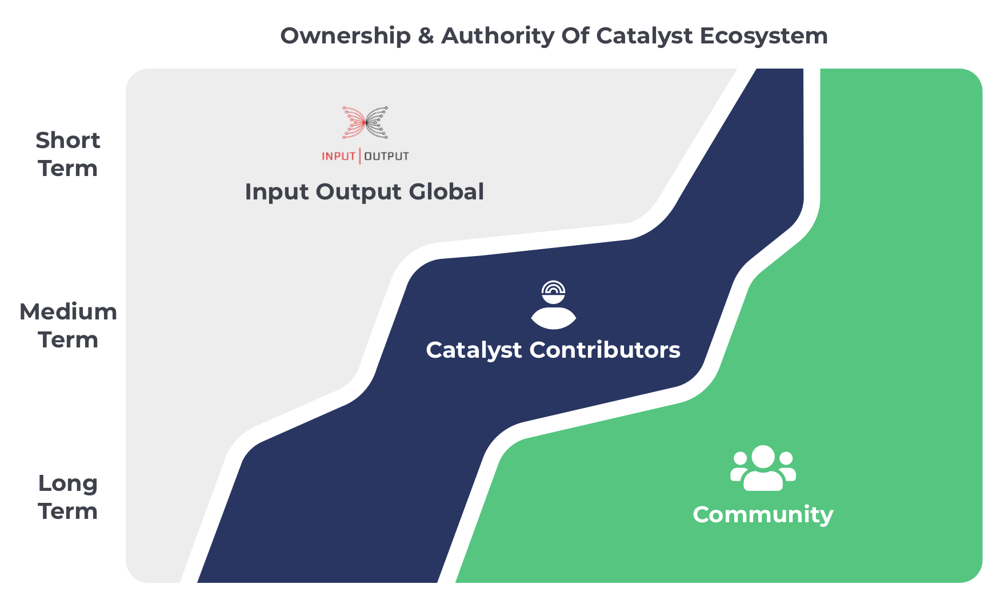

# Ownership & Authority Plan

There are a number of different ways in which ownership and authority can be passed over to the community. Analysis on this topic area highlighted how a cohort of individuals would be a simple and effective model to achieve this.

Electing a number of individuals offers a simple approach to passing over ownership and authority to the community. The model can contract and expand as required to support and improve the Catalyst ecosystem.

A safe and incremental plan is needed to outline how the ownership and authority can be passed over to Catalyst contributors with a rough plan of which systems and processes are involved. These suggestions are not fixed and are merely ideas for how ownership and authority can be incrementally passed over to the community.

### Scope

Currently all of the core parts of the Catalyst ecosystem are owned and operated by IOG. This ownership over the ecosystem includes usage of web services like Ideascale to facilitate the proposal submission and assessment process.

The scope of Catalyst contributors is to provide a way for IOG to pass over ownership and authority to an elected group of community members that can help to develop and support the Catalyst ecosystem. Catalyst contributors are well suited for taking over ownership and control of core processes and systems. There is a need for this solution as IOG does not have a plan to develop all of the tools and solutions needed for the funding process to effectively function and scale. Catalyst contributors can support initiatives that improve the systems and processes involved. These initiatives could be from the contributors themselves or from other community members that propose new solutions.

Over the long term Catalyst contributors would look to automate and optimise the system and processes involved to reduce the need for hiring as many Catalyst contributors that help moderate and support the process. Efforts to automate and scale will help to reduce the risks of having elected representatives and also increase the cost efficiency of the process. Full time contributors may also be suitable as a long term solution to help with the moderation of the funding process. Other incentives may also be developed that reduce the need for full time support and oversight of the process completely. At this stage it is difficult to determine exactly how much of the systems and processes over the long term can be fully optimised and require little to no oversight.

## Short term

****

**Theme**

Support, organise and learn

**How is ownership and authority changing?**

* Input Output Global - IOG has majority of the ownership and authority over the core parts of Catalyst ecosystem such as funding dates and amounts, moderation, proposal infrastructure, voting infrastructure and result tallying.
* Catalyst Contributors - Low risk systems and processes can be passed over to contributors so they can start taking ownership of supporting processes. This will help to enable IOG to have more capacity to focus on maintaining the higher risk areas with more capacity.
* Community - The community continue to have authority in core areas of the funding process such as around voting, assessments and the review of assessments.

### Relevant **systems and processes**

Any of the following systems or processes can be picked up by Catalyst contributors immediately once they are elected or after a short onboarding period.

**Documentation**

Catalyst contributors can handle the documentation for how the Catalyst funding process operates including any high level guides such as how to do proposal assessment and others. IOG would have authority to contribute to this documentation and both IOG and Catalyst contributors would work side by side. Catalyst contributors can help with increasing documentation coverage and support any terminology or wording improvements.

**Education & training**

Any videos, podcasts or educational materials made by the community or Catalyst contributors can be aggregated together to showcase to the community. Bringing these resources together will help keep the community informed about learning about the Catalyst process. Catalyst contributors are well suited to facilitating proposers in going through the process with workshops and one to ones as well as supporting any voters by answering questions. Catalyst contributors can help to make and improve resources for any common questions so that newcomers can be more easily onboarded over time. Supporting the ecosystem could also include translation support in the materials managed by Catalyst contributors.

**Events & calendar management**

There are a number of events that can be beneficial to bring together the community to share ideas, problems and discuss what is happening in the ecosystem. Catalyst contributors can help to create and manage a schedule of these events along with managing a calendar to help engage the community most effectively. Catalyst contributors can help with creating the right environments in different events and resources to promote a collaborative and welcoming culture in Catalyst.

**Moderation and community support**

Chat channels such as through services like Discord or Telegram regularly need moderation from bad actors as well as support for community members asking questions. Catalyst contributors can support in this process by becoming moderators in these channels and help to remove bad actors or support the wider community.

**Problem sensing**

Catalyst contributors can support efforts on documenting the problems in the community into a product development workflow which can be prioritised and then explored to determine how those problems could be solved.

## Medium term

**Theme**

Build, iterate and analyse

**How is ownership and authority changing?**

* Input Output Global - IOG starts to hand over core systems and processes to Catalyst contributors. This may start with giving contributors just authority to manage systems and processes before then eventually passing over full ownership once certain outcomes and safety guarantees are achieved.
* Catalyst Contributors - Over the medium term contributors would reach their peak size. A diverse number of people would be helping to build and manage the solutions needed for Catalyst to operate and scale. Contributors will start managing their own treasury to help facilitate this growth and development of core Catalyst systems and processes. Contributors would execute a full product development workflow on prioritised tasks. Increasing amounts of systems and processes are being handled by full time contributors. Complex decisions start being handled by contributors using new processes to help improve the funding process. An example could be dealing with auditing the progress of funded proposals. Contributors could act on situations where they find funded proposers that are not meeting their obligations by pausing any funding to that team until progress is presented.
* Community - Community members can start to be paid by the Catalyst contributor treasury to contribute to certain parts of the ecosystem with improvements or support. Catalyst contributors can start trialling identity and reputation systems with part time contributors and the wider community. These efforts can start to diversify and distribute who is involved in Catalyst ecosystem decisions and who makes contributions. The community are part of any discussions on ecosystem changes. Continuous effort is made to increase the communities ability to vote on Catalyst changes for those who want to participate in governance.

### Relevant systems and processes

Some of the following system of processes could be explored immediately however others would need to allow time for the contributors to establish internal working processes and structures for them to be productive and accountable for their actions.

**Execute product development workflow**

Once prioritised problems are added by the community or by Catalyst contributors that need solving they can start to be addressed by the contributors. Catalyst contributors will have a range of skill sets in each cohort that can take problems through to solution execution to improve the Catalyst systems and processes.

**Catalyst focussed treasury**

Catalyst contributors are well suited to handling a treasury focussed specifically on supporting and improving Catalyst. This treasury can be seen as a rapid funding mechanism to support the Catalyst ecosystem. Any funds managed by Catalyst contributors would go towards efforts that help improve the systems or processes within Catalyst. This could support many initiatives such as paying for contractors to build out technical solutions, paying for auditors to help audit existing funded proposals or any other relevant scenarios.

**Auditing proposal progress**

Auditing funded proposals is a vital part of the process to ensure deliverables are being met. Catalyst contributors can support in this process and identify when proposers aren’t meeting their obligations. In these events contributors can be given the authority to vote on whether an existing proposers funding should be paused until progress has been shown. This will be an important evolution of auditing process to ensure funds are not being wasted and that the process can scale. Catalyst contributors can take lessons from this process to create tools and better processes to help support the auditing phase of the funding process. Incentives can also be explored on how these efforts can further be pushed to the edges of the community.

**Catalyst identity & reputation**

Catalyst contributors can help with exploring different governance solutions instead of the current plutocratic approach. Catalyst contributors are a good starting point for identity solutions as contributors can be issued a credential when they are elected to be a Catalyst contributor. Catalyst contributors can then contribute towards this area of identity further by then becoming issuers of credentials to other community members. This means part time contributors can become a growing part of the community that can establish their own identity in the ecosystem. Catalyst contributors are also well suited to help establish and grow reputation models that help community members build up their reputation.

**Catalyst core system and process ownership**

The main system and processes of concern include proposal submission, proposal assessment and voting infrastructure used for the funding process. The system and processes for Catalyst are currently centralised on web services such as Ideascale. Catalyst contributors will be responsible for helping the community move away from these services and create alternatives that improve on existing approaches and decentralize the process. Contractors and external community members to Catalyst contributors will likely collaborate on defining and building these solutions.

## Long term

**Theme**

Optimise, automate and scale

**How is ownership and authority changing?**

* Input Output Global - IOG has handed over many or all of the core parts of the process to Catalyst contributors and work closely with the contributors to analyse and assess any risks of moving parameter control to either the Catalyst contributors or straight to the community. Checks and balances are defined to ensure the right knowledge and safe guards are in place.
* Catalyst Contributors - Catalyst contributors continue working on the core parts of the Catalyst process and now start to analyse how the system, processes and parameters can be better understood, automated and scaled. Efforts here are to focussed on making Catalyst contributors more redundant in the process based on lessons learnt. These efforts will help to increase efficiencies, add automation and create suitable incentive structures that help push control further into the community.
* Community - The community would be able to participate in the core parameter changes and decisions in the Catalyst process. Increasingly the community is able to participate in all the relevant governance decisions within Catalyst once the right identity and reputation systems are put in place. Safeguards for identity solutions are also available that are sybil resistant and prevent malicious actors at scale. Increased execution effort here will help to reduce the reliance on Catalyst contributors to moderate important governance processes.

### Relevant **systems and processes**

This optimisation and improvements will require deployed solutions with sufficient data for Catalyst contributors to effectively automate, optimise and scale the different systems and processes.

**Catalyst paramaters**

There are a number of parameters used in Catalyst that define how things operate. For instance a funding round happens after a certain number of weeks, has a certain amount of funding used and has a certain amount of time used for each stage of the process. All of these parameters need to be well defined and analysed to look at how they have performed previously and what implications they would have on the process if they were set to a range of different values by the community. Catalyst contributors would look to formalise an approach to optimising and automating these parameters where possible. Efforts are increased to continue to decentralise the process and ensure the safe guards are in place to prevent malicious actors.

**System and process scaling and automation**

Handling a wide and increasing range of proposals, goals, objectives and participants are important for Catalyst to scale to a global audience whilst also still effectively distributing Cardano treasury funding. Scaling the systems and processes will mean refining the technical infrastructure so that it can handle the pressures of scaled usage. To improve automation analysis will be made on the systems to try and reduce complexity where possible so that Catalyst contributors become a decreasing bottleneck and authority in the process. Measuring and understanding scalable incentives will be a part of how different systems and processes can be automated and how control is pushed to the edges. Key considerations will be made towards the game theory, cost efficiency and security involved for each parts of the ecosystem.
